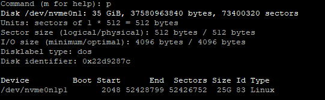

# Listing, Creating, and Deleting Partitions of GPT Disk

> Some partitions are larger than others.
> The larger partitions are typically associated for use with file storage.
> Other partitions (one) will be dedicated to boot partitions. 
> Partitions take up disk space.

Partitions are held on: 
```/dev/<partition device><partition #>```

> (ie: /dev/vda1)
> 
> (ie: /dev/vda2)

1. Partitions are typically prefixed by vda or sda
2. Partitions are dividers that split up a disk into smaller chunks.

There are 3 types of partition manipulation techniques/programs we 
can use:
1. parted
2. gdisk
3. fdisk (most popular)


# Fdisk Commands (interface for manipulating partitions):

### Listing partitions of the current disk: 
command: ```fdisk -l```


### Creating a Partition:
command: ```fdisk /dev/<partition device>``` 
> (<partition device> can either be sda, vda...)


### Deleting a Partition: 
> deleting a partition relieves the disk space to reallocate disk space for any future use.

command: ```fdisk /dev/<partition device>```
  
enter: ```d```
> this starts the deletion process.
**Note** - Before deleting a partition:
<pre>
1. check for partition information by entering: i (lists all partiitons)
2. enter the partition number to list further details on it.
3. if we want to delete this particular parititon, make sure to enter its number when prompted during the delete phase.
</pre>
command: ```#``` (enter the partition number)


### Rebooting the system after making change to partition table: 
command: ```partprobe```


## Resizing partition space: 
  
1. fdisk /dev/<disk>
2. p (to show the partitions on the disk)
  

  
3. ```d``` (delete the partition, in this case there is only a single partition)
4. ```n``` (make a new partition)
5. ```p``` (for primary partition)
6. ```1``` (for default partition number. There are a max of 4 partitions per disk)
7. Input the start sector number of the old device above (2048)
8. Input the end sector number 
> (this is always the highest value of the Disk sector, this case we want the partition to take up the entire Disk space of 73400320 - 1 = 73400319 
9. When prompted to remove the signature: type ```N``` or ```No```. 
> We want to include the existing partition file system type from the previously deleted partition. 
10. ```p``` (to list if what we did looks good. Check partition sizes etc)
11. ```w``` (to write changes to disk).
12. ```resize2fs /dev/<path>/<to partition>/``` (to expand the file system to match the size of the partition.)


